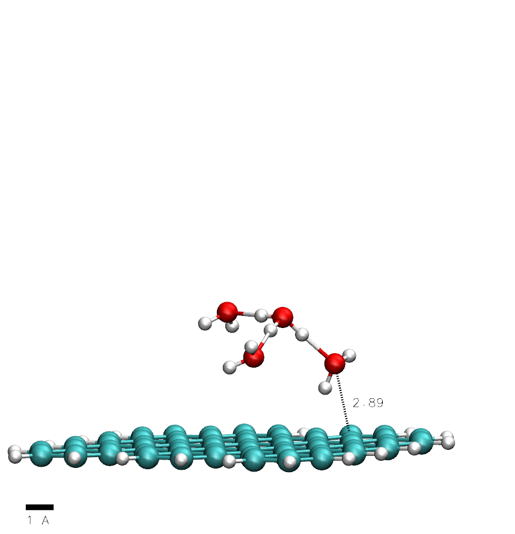

Coordinates in xyz and pdb format corresponding to the optimized geometry for a solvated proton near a graphene flake.
We consider an $$\text{H}_3\text{O}^+$$ cation surrounded by 3 water molecules, the so-called Eigen ion  $$\text{H}_9\text{O}_4^+$$ close to a graphene flake as described in our publication.

